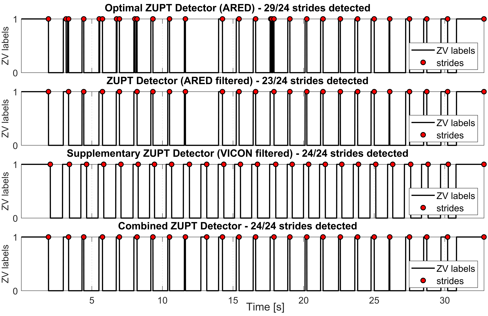
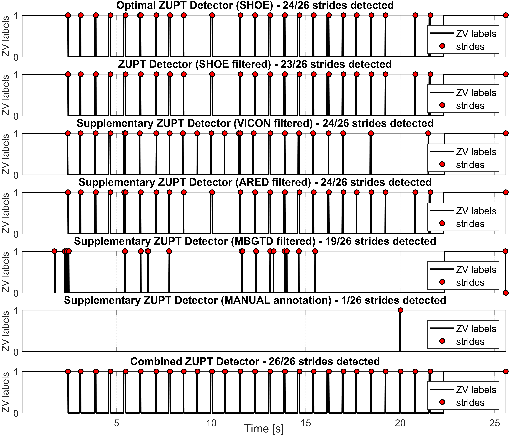

<h2>PyShoe Dataset Annotation for Loose Learned Inertial Odometry (LLIO)</h2>
<p align="justify">Just like in <a href="https://github.com/mtahakoroglu/LLIO-aied-PyShoe">LLIO-aided-PyShoe</a> repo, one needs the following installations to run the scripts and obtain the results shown here and in the paper.</p>

<h3>Creating <b>pyshoe</b> Virtual Environment in Anaconda</h3>
<p align="justify">After installing Anaconda, launch <b>Anaconda PowerShell</b> and then type</p>

```
conda create --name pyshoe python=3.7
```

<p align="justify">to create <b>ipyshoe</b> virtual environment (venv). Subsequently, type</p>

```
conda activate pyshoe
```

<p align="justify">to activate <b>pyshoe</b> venv.</p>

<h3>Installing Required Packages</h3>
<p align="justify">Type and enter the following commands in Anaconda PS terminal to install the required packages and libraries to run PyShoe codes and reproduce the results in the page and the paper. We thank <a href="https://scholar.google.com.tr/citations?user=F2NkKNAAAAAJ&hl=tr">Dr. Ramazan Özgür Doğan</a> for the assistance in setting up the environment.</p>

```
conda install pytorch==1.13.1 torchvision==0.14.1 torchaudio==0.13.1 pytorch-cuda=11.7 -c pytorch -c nvidia
```

```
pip install torch==1.13.1+cu117 torchvision==0.14.1+cu117 torchaudio==0.13.1 --extra-index-url https://download.pytorch.org/whl/cu117
```


<p align="justify">Continue and complete the installation by entering the following commands in Anaconda PS in <b>pyshoe</b> virtual environment.<p>

```
conda install scikit-learn==0.19.1
```

```
conda install matplotlib
```

```
pip install pandas==1.1.5
```

<h3>Installing <b>liegroups</b> package</h3>

<p align="justify">After cloning this repository to your local computer, you must install <b><a href="https://github.com/utiasSTARS/liegroups" target="_blank">liegroups</a></b> package to run the code if you would like to reproduce the results shown here in this repo or the paper.</p>

<h3>VICON Training Manual Annotation (Corrections)</h3>

<p align="justify">To extract a gait-driven system (stride & heading system - SHS) from VICON training dataset, which is a sampling-frequency driven system (sample-wise INS), displacement and heading change values at <b>each</b> stride must be generated. Subsequently, produced displacement and heading change values will be used in training a data-driven (also called modern) SHS, which will function as learned inertial odometry and eventually aid the traditional dead reckoning system (i.e., robust ZUPT aided Error-State Kalman Filter based pedestrian INS).</p>

<p align="justify">Here, some troublesome experiments are shown to understand Zero Velocity (ZV) interval and stride detection problems. The optimal ZV detectors are run (e.g., SHOE for experiment 4, ARED for experiment 6) with the corresponding optimal threshold values (optimal values are supplied by Wagstaff <i>et. al.</i> in the structure of the mat files for VICON room experiments of PyShoe dataset).</p>

<p align="justify"><b>The process described here is the manual annotation of troublesome parts of some experiments of VICON training dataset. This way ZV interval and stride detection errors in the <b>bipedal locomotion</b> training data would be fixed.</b> While correcting for the missed stride(s) one by one in the experiments <b>with at least one missed stride</b>, crawling experiments (non-bipedal motion) were excluded by observing zero-velocity plots qualitatively. PyShoe is based on OpenShoe ZUPT aided EKF method, which is a traditional double integration approach (in prediction step of KF) where the corrections are made in periodic ZUPT phase (correction step of KF). Including non-bipedal locomotion data such as crawling experiments inherently affected PyShoe (i.e., adaptive version of OpenShoe) performance on walking and running data negatively by missing some ZV phases and corresponding strides. Eventually, after correction process of VICON room experiments, bipedal locomotion training dataset is going to be formed and subsequently the bi-LSTM network will be retrained for robust ZUPT phase (and stride) detection for bipedal locomotion data such as walking, jogging and running.</p>

<p align="justify">Please use <b>detect_missed_strides.m</b> located at <b>data/vicon/processed</b> if you like to reproduce the figures related to training dataset correction.</p>

<h4>Experiment 4 (2017-11-22-11-25-20) - VICON training dataset</h4>

<p align="justify">We see that the 10th stride is not detected in the plots below. It is more obvious to notice it in ZV plot yet one may detect the missed stride in the trajectory plot as well when carefully tracked strating from the initial stride.</p>


<p align="justify">As mentioned above, to detect the missed stride(s), supplementary detectors such as VICON, ARED, MBGTD or AMVD will be exploited. In general, VICON detector was able to generate ZV labels correctly; therefore, in many of the cases, we only used VICON ZUPT detector as the only supplementary detector.</p>


<p align="justify">Integration of filtered optimal ZUPT detector SHOE with the supplementary ZUPT detector (i.e., filtered VICON) enabled successfull detection of the missed stride as shown in the combined ZUPT detector plot above (located at the bottom). The corrected stride & heading system trajectory and ZV labels can be seen below for the experiment 4. Note that the correction is only going to be used in extracting displacement and heading change values for further research on Deep Learning based modern INS development; therefore, corrected ZV labels are not used in any INS generation.</p>


<p align="justify">The gif file inserted below shows the correction explicitly.</p>


<h4>Experiment 6 (2017-11-22-11-26-46) - VICON training dataset</h4>

<p align="justify">We see that the 9th stride is not detected in the plots below.</p>


<p align="justify">Just like we did to compensate for the errors ZUPT phase and stride detection in experiment 4, here VICON ZUPT detector is selected again as the supplementary detector to correctly detect the missed stride.</p>



<p align="justify">Integration of filtered optimal ZUPT detector SHOE with the supplementary ZUPT detector (i.e., filtered VICON) enabled successfull detection of the missed stride as shown in the combined ZUPT detector plot above (located at the bottom). The corrected stride & heading system trajectory and ZV labels can be seen below for the experiment 6.</p>


<p align="justify">To see the correction by the supplementary ZUPT detector, check the gif file inserted below.</p>


<h4>Experiment 11 (2017-11-22-11-35-59) - VICON training dataset</h4>

<p align="justify">We see that the 7th stride is not detected in the plots below.</p>


<p align="justify">Just like we did to compensate for the errors in ZUPT phase and stride detection in experiments 4 and 6, here VICON ZUPT detector is selected again as the supplementary detector to correctly detect the missed stride.</p>


<p align="justify">Integration of filtered optimal ZUPT detector SHOE with the supplementary ZUPT detector (i.e., filtered VICON) enabled successfull detection of the missed stride as shown in the combined ZUPT detector plot above (located at the bottom). The corrected stride & heading system trajectory and ZV labels can be seen below for the experiment 11.</p>


<p align="justify">To see the correction by the supplementary ZUPT detector, check the gif file inserted below.</p>


<h4>Experiment 18 (2017-11-22-11-48-35) - VICON training dataset</h4>

<p align="justify">We see that the 7th stride is not detected in the plots below.</p>


<p align="justify">Just like we did to compensate for the errors ZUPT phase and stride detection in experiments 4, 6, and 11, here VICON ZUPT detector is selected again as the supplementary detector to correctly detect the missed stride.</p>


<p align="justify">Integration of filtered optimal ZUPT detector SHOE with the supplementary ZUPT detector (i.e., filtered VICON) enabled successfull detection of the missed stride as shown in the combined ZUPT detector plot above (located at the bottom). The corrected stride & heading system trajectory and ZV labels can be seen below for the experiment 18.</p>


<p align="justify">To see the correction by the supplementary ZUPT detector, check the gif file inserted below.</p>


<h4>Experiment 27 (2017-11-27-11-12-44) - VICON training dataset</h4>

<p align="justify">We see that the strides {9, 16, 17, 18} are not detected in the plots below.</p>


<p align="justify">Unlike for the compensation for the errors in ZUPT phase and stride detection in experiments 4, 6, 11 and 18, here VICON ZUPT detector was not sufficient to detect all missed strides. An additional ZV detector (MBGTD) is exploited to detect the last missed stride.</p>


<p align="justify">Integration of filtered optimal ZUPT detector SHOE with the supplementary ZUPT detectors (i.e., filtered VICON and filtered MBGTD) enabled successfull detection of the missed strideS as shown in the combined ZUPT detector plot above (located at the bottom). The corrected stride & heading system trajectory and ZV labels can be seen below for the experiment 27.</p>


<p align="justify">To see the correction by the supplementary ZUPT detectors, check the gif file inserted below.</p>


<h4>Experiment 30 (2017-11-27-11-14-03) - VICON training dataset</h4>

<p align="justify">We see that the strides {2, 10} are not detected in the plots below.</p>


<p align="justify">Unlike experiments {4, 6, 11, 18, 27}, here SHOE ZUPT detector is selected as the supplementary detector to correctly detect the missed strides.</p>


<p align="justify">Integration of filtered optimal ZUPT detector VICON with the supplementary ZUPT detector (i.e., filtered SHOE) enabled successfull detection of the missed stride as shown in the combined ZUPT detector plot above (located at the bottom). The corrected stride & heading system trajectory and ZV labels can be seen below for the experiment 30.</p>


<p align="justify">To see the correction by the supplementary ZUPT detector, check the gif file inserted below.</p>


<h4>Experiment 32 (2017-11-27-11-17-28) - VICON training dataset</h4>

<p align="justify">We see that the strides {9, 11, 20} are not detected in the plots below.</p>


<p align="justify">Unlike experiments {4, 6, 11, 18, 27, 30}, here supplementary detectors were not able to detect all missed strides. While first two was recovered by VICON ZV detector, the last stride needed to be introduced via manual annotation as can be seen below.</p>



<p align="justify">Integration of filtered optimal ZUPT detector SHOE with the supplementary ZUPT detector (i.e., filtered VICON) and the MANUAL ANNOTATION enabled successfull detection of all missed strides as shown in the combined ZUPT detector plot above (located at the bottom). The corrected stride & heading system trajectory and ZV labels can be seen below for the experiment 32.</p>


<p align="justify">To see the correction by the supplementary ZUPT detector, check the gif file inserted below.</p>


<h4>Experiment 36 (2017-11-27-11-23-18) - VICON training dataset</h4>

<p align="justify">We see that the 7<sup>th</sup> stride is not detected in the plots below.</p>


<p align="justify">Just like the 4<sup>th</sup> experiment, here the supplementary detector is selected as VICON, which was able to recover the missed stride.</p>


<p align="justify">Integration of filtered optimal ZUPT detector SHOE with the supplementary ZUPT detector (i.e., filtered VICON) enabled successfull detection of the missed stride as shown in the combined ZUPT detector plot above (located at the bottom). The corrected stride & heading system trajectory and ZV labels can be seen below for the experiment 36.</p>


<p align="justify">To see the correction by the supplementary ZUPT detector, check the gif file inserted below.</p>


<h4>Experiment 38 (2017-11-27-11-25-12) - VICON training dataset</h4>

<p align="justify">We see that the strides {3, 27, 33} are not detected in the plots below.</p>


<p align="justify">The supplementary detector is selected as VICON, which was able to recover the missed strides all.</p>


<p align="justify">Integration of filtered optimal ZUPT detector SHOE with the supplementary ZUPT detector (i.e., filtered VICON) enabled successfull detection of the missed strides as shown in the combined ZUPT detector plot above (located at the bottom). The corrected stride & heading system trajectory and ZV labels can be seen below for the experiment 38.</p>


<p align="justify">To see the correction by the supplementary ZUPT detector, check the gif file inserted below.</p>


<h4>Experiment 43 (2017-12-15-18-01-18) - VICON training dataset</h4>

<p align="justify">We see that the strides {3, 14, 16} are not detected in the plots below.</p>


<p align="justify">The supplementary detector is selected as VICON, which was able to recover the missed strides all.</p>


<p align="justify">Integration of filtered optimal ZUPT detector SHOE with the supplementary ZUPT detector (i.e., filtered VICON) enabled successfull detection of the missed strides as shown in the combined ZUPT detector plot above (located at the bottom). The corrected stride & heading system trajectory and ZV labels can be seen below for the experiment 43.</p>


<p align="justify">To see the correction by the supplementary ZUPT detector, check the gif file inserted below.</p>


<p align="justify">Here, due to some undetected steps in VICON training data (recall that Wagstaff <i>et. al.</i> (i.e., the creator of PyShoe dataset) included crawling data) and self-collected data, we needed to go over the 56 experiments in the training dataset <i><b>(i)</b></i> to correct for undetected steps (they are classified as 0 in ZV signal plot despite them actually being 1, i.e., it is false-negative) and <i><b>(ii)</b></i> to exclude motions like crawling, which are not of type bipedal locomotion. For this reason, we had to retrain the bi-LSTM network proposed by Wagstaff <i>et. al.</i>. In order to use GPU in the training process, instead of the PyTorch installation command given above, we used the one below.</p>


<h3>Example Results with LSTM Based Robust ZUPT Method (Own Sensor Data)</h3>
<p align="justify">Here robust pre-trained LSTM based ZV detector pedestrian INS is applied on our own-collected data (where our sensor is 3DM-GX5-25).</p>

<p align="justify">We assume the start point is numbered as stride #0, i.e., initial stride. Note that ZV labels are filtered for accurate stride detection but the filtered ZV values are not used in the trajectory generation in the associated trajectory plot. In other words, the trajectory is obtained with raw (not filtered) LSTM ZUPT detected ZV labels while the strides (visualized on the trajectory with x) are marked at the indices shown in filtered LSTM generated ZV plots.</p>

<p align="justify">Note that some experiments do not contain GCP or contain incorrectly documented GCP and thereby are not considered in performance evaluation. Also, in some experiments correct number of strides are not detected (with LSTM based robust ZV detector). These experiments are not used in evalation as well. However, in future, if a better ZV interval detector can be developed and detect all strides without missing any, then mentioned experiments could be involved in evaluation process.</p>

<p align="justify"><b>Note:</b> One can run <b>plot_own_sensor_data.py</b> to obtain the same results shown below. To learn more about experiment info and results, one can view <b>output.txt</b> log file (located at <b>results/figs/own</b>) recorded while the code was running.</p>

<h4>Experiment 6 (GCP not available)</h4>


| Zero Velocity |  Trajectory  |
|  :---:  |  :---:  |
|  |  |

<h4>Experiment 11 (GCP not available)</h4>


| Zero Velocity |  Trajectory  |
|  :---:  |  :---:  |
|  |  |

<h4>Experiment 13 (GCP not available)</h4>


| Zero Velocity |  Trajectory  |
|  :---:  |  :---:  |
|  |  |

<h4>Experiment 14 (GCP not available)</h4>


| Zero Velocity |  Trajectory  |
|  :---:  |  :---:  |
|  |  |

<h4>Experiment 15 (GCP available & all strides detected correctly)</h4>


| Zero Velocity |  Trajectory  |
|  :---:  |  :---:  |
|  |  |

<h4>Experiment 16 (GCP available but not correct)</h4>

<p align="justify">Despite correct detection of all strides, due to errors in GCP documentation, this experiment is not considered in performance evaluation.</p>


| Zero Velocity |  Trajectory  |
|  :---:  |  :---:  |
|  |  |

<h4>Experiment 17</h4>


| Zero Velocity |  Trajectory  |
|  :---:  |  :---:  |
|  |  |

<h4>Experiment 18</h4>


| Zero Velocity |  Trajectory  |
|  :---:  |  :---:  |
|  |  |

<h4>Experiment 19</h4>


| Zero Velocity |  Trajectory  |
|  :---:  |  :---:  |
|  |  |

<h4>Experiment 20</h4>


| Zero Velocity |  Trajectory  |
|  :---:  |  :---:  |
|  |  |

<h4>Experiment 21 (42/43 strides detected) - Failure (23<sup>rd</sup> ZV interval (and the corresponding stride) is missed)</h4>


| Zero Velocity |  Trajectory  |
|  :---:  |  :---:  |
|  |  |

<h4>Experiment 22</h4>


| Zero Velocity |  Trajectory  |
|  :---:  |  :---:  |
|  |  |

<h4>Experiment 23</h4>


| Zero Velocity |  Trajectory  |
|  :---:  |  :---:  |
|  |  |

<h4>Experiment 24</h4>


| Zero Velocity |  Trajectory  |
|  :---:  |  :---:  |
|  |  |

<h4>Experiment 25</h4>


| Zero Velocity |  Trajectory  |
|  :---:  |  :---:  |
|  |  |

<h4>Experiment 26</h4>


| Zero Velocity |  Trajectory  |
|  :---:  |  :---:  |
|  |  |

<h4>Experiment 27</h4>


| Zero Velocity |  Trajectory  |
|  :---:  |  :---:  |
|  |  |

<h3>VICON Training Manual Annotation (Corrections)</h3>

<h4>Experiment 28 (a longer pedestrian traverse)</h4>


| Zero Velocity |  Trajectory  |
|  :---:  |  :---:  |
|  |  |

<h4>Experiment 29 (same path with exp 28 but at a higher pace)</h4>


| Zero Velocity |  Trajectory  |
|  :---:  |  :---:  |
|  |  |

<h4>Experiment 30 (same path with exp 28-29 but at the highest pace, i.e., almost running)</h4>


| Zero Velocity |  Trajectory  |
|  :---:  |  :---:  |
|  |  |


<h2>REFERENCES</h2>
<p align="justify" id="ref1"><a href="#gobacktoref1">[1]</a> X. Liu, N. Li and Y. Zhang, <a href="https://ieeexplore.ieee.org/document/9956821" target="_blank">"A Novel Adaptive Zero Velocity Detection Algorithm Based on Improved General Likelihood Ratio Test Detector,"</a> in <i>IEEE Sensors Journal</i>, vol. 22, no. 24, pp. 24479-24492, 2022.</p>
<p align="justify" id="ref2"><a href="#gobacktoref2">[2]</a> B. Wagstaff, V. Peretroukhin and J. Kelly, <a href="https://ieeexplore.ieee.org/document/8115947" target="_blank">"Improving foot-mounted inertial navigation through real-time motion classification,"</a> in <i>2017 International Conference on Indoor Positioning and Indoor Navigation (IPIN)</i>, Sapporo, Japan, 2017, pp. 1-8.</p>
<p align="justify" id="ref3"><a href="#gobacktoref3">[3]</a> E. Sangenis, C. -S. Jao and A. M. Shkel, <a href="https://ieeexplore.ieee.org/abstract/document/9967027" target="_blank">"SVM-based Motion Classification Using Foot-mounted IMU for ZUPT-aided INS,"</a> in <i>2022 IEEE Sensors</i>, Dallas, TX, USA, 2022, pp. 1-4.</p>
<p align="justify" id="ref4"><a href="#gobacktoref4">[4]</a> Y. Wang and A. M. Shkel, <a href="https://ieeexplore.ieee.org/document/8861375" target="_blank">"Adaptive Threshold for Zero-Velocity Detector in ZUPT-Aided Pedestrian Inertial Navigation,"</a> in <i>IEEE Sensors Letters</i>, vol. 3, no. 11, pp. 1-4, 2019.</p>
<p align="justify" id="ref5"><a href="#gobacktoref5">[5]</a> Y. Wang and A. M. Shkel, <a href="https://ieeexplore.ieee.org/document/9133730" target="_blank">"A Review on ZUPT-Aided Pedestrian Inertial Navigation,"</a> in <i>2020 27th Saint Petersburg International Conference on Integrated Navigation Systems (ICINS)</i>, St. Petersburg, Russia, 2020.</p>
<p align="justify" id="ref6"><a href="#gobacktoref6">[6]</a> J. Wahlström, I. Skog, F. Gustafsson, A. Markham and N. Trigoni, <a href="https://ieeexplore.ieee.org/abstract/document/8715398" target="_blank">"Zero-Velocity Detection—A Bayesian Approach to Adaptive Thresholding,"</a> in <i>IEEE Sensors Letters</i>, vol. 3, no. 6, pp. 1-4, June 2019.</p>
<p align="justify" id="ref7"><a href="#gobacktoref7">[7]</a> Z. Meng, Z. Deng, P. Zhang and Z. Li, <a href="https://ieeexplore.ieee.org/document/10472598" target="_blank">"Adaptive Mid-Stance Phase Observer-Aided Pedestrian Inertial Navigation System for Varying Gait Speeds,"</a> in <i>IEEE Internet of Things Journal</i>, vol. 11, no. 12, pp. 21904-21915, 15 June, 2024.</p>
<p align="justify" #id="ref8"><a href="#gobacktoref8">[8]</a> C. . -S. Jao, K. Stewart, J. Conradt, E. Neftci and A. M. Shkel, <a href="https://ieeexplore.ieee.org/document/9244906" target="_blank">"Zero Velocity Detector for Foot-mounted Inertial Navigation System Assisted by a Dynamic Vision Sensor,"</a> in <i>2020 DGON Inertial Sensors and Systems (ISS)</i>, Braunschweig, Germany, 2020, pp. 1-18.</p>
<p align="justify" #id="ref9"><a href="#gobacktoref9">[9]</a> C. -S. Jao, Y. Wang and A. M. Shkel, <a href="https://ieeexplore.ieee.org/document/9278755" target="_blank">"A Zero Velocity Detector for Foot-mounted Inertial Navigation Systems Aided by Downward-facing Range Sensor,"</a> in <i>2020 IEEE SENSORS</i>, Rotterdam, Netherlands, 2020, pp. 1-4.</p>
<p align="justify" #id="ref10"><a href="#gobacktoref10">[10]</a> <a href="https://starslab.ca/foot-mounted-inertial-navigation-dataset/">University of Toronto STARS Lab. Foot-Mounted Inertial Navigation Dataset</a></p>
<p align="justify" #id="ref11"><a href="#gobacktoref11">[11]</a> Brandon Wagstaff, Valentin Peretroukhin, Jonathan Kelly, July 20, 2021, <a href="https://ieee-dataport.org/open-access/university-toronto-foot-mounted-inertial-navigation-dataset" target="_blank">"University of Toronto Foot-Mounted Inertial Navigation Dataset"</a>, IEEE Dataport, doi: <a href="https://dx.doi.org/10.21227/v1z6-9z84">https://dx.doi.org/10.21227/v1z6-9z84</a>.</p>
<p align="justify" #id="ref12"><a href="#gobacktoref10">[12]</a> J. Wahlström and I. Skog, <a href="https://ieeexplore.ieee.org/document/9174869" target="_blank">"Fifteen Years of Progress at Zero Velocity: A Review,"</a> in <i>IEEE Sensors Journal</i>, vol. 21, no. 2, pp. 1139-1151, 15 Jan., 2021.</p>
<a href="https://scholar.google.com/citations?view_op=view_citation&hl=en&user=9rHhb5IAAAAJ&citation_for_view=9rHhb5IAAAAJ:iH-uZ7U-co4C" target="_blank"></a>
<p align="justify"#id="ref13"><a href="#gobacktoref13">[13]</a> Guimarães, V.; Sousa, I.; Correia, M.V. <a href="https://www.mdpi.com/1424-8220/21/11/3940" target="_blank">Orientation-Invariant Spatio-Temporal Gait Analysis Using Foot-Worn Inertial Sensors.</a> <i>Sensors</i> 2021, 21, 3940.</p>
<p align="justify"#id="ref14"><a href="#gobacktoref14">[14]</a> Guimarães, V.; Sousa, I.; Correia, M.V. <a href="https://www.mdpi.com/1424-8220/21/22/7517" target="_blank">A Deep Learning Approach for Foot Trajectory Estimation in Gait Analysis Using Inertial Sensors.</a> <i>Sensors</i> 2021, 21, 7517.</p>
<p align="justify"#id="ref15"><a href="#gobacktoref15">[15]</a> J. Li et al., <a href="https://ieeexplore.ieee.org/abstract/document/10229495" taget="_blank">"Learning-Based Stance Phase Detection and Multisensor Data Fusion for ZUPT-Aided Pedestrian Dead Reckoning System,"</a> in <i>IEEE Internet of Things Journal</i>, vol. 11, no. 4, pp. 5899-5911, 15 Feb., 2024.</p>
</ul>