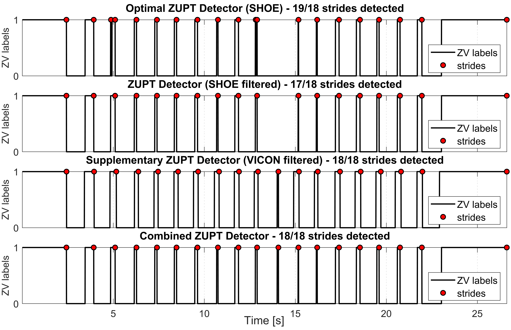

<h2>PyShoe Dataset - Correction for Bipedal Locomotion</h2>
<p align="justify">Just like in <a href="https://github.com/mtahakoroglu/OpenShoe-PyShoe-DeepShoe-FuseShoe">PyShoe-OpenShoe-DeepShoe-FuseShoe</a> repo, one needs the following installations to run the required scripts and obtain the results shown here and in the paper.</p>

<h3>Creating PyShoe Virtual Environment in Anaconda</h3>
<p align="justify">After installling Anaconda, launch <b>Anaconda PowerShell</b> and then type</p>

```
conda create --name pyshoe python=3.7
```

<p align="justify">to create <b>pyshoe</b> virtual environment (venv). Subsequently, type</p>

```
conda activate pyshoe
```

<p align="justify">to activate <b>pyshoe</b> venv.</p>

<h3>Installing Required Packages</h3>
<p align="justify">Type and enter the following commands in Anaconda PS terminal to install the required packages and libraries to run PyShoe codes and reproduce the results in the page and the paper. We thank <a href="https://scholar.google.com.tr/citations?user=F2NkKNAAAAAJ&hl=tr">Dr. Ramazan Özgür Doğan</a> for the assistance in setting up the environment.</p>

```
conda install pytorch==1.13.1 torchvision==0.14.1 torchaudio==0.13.1 pytorch-cuda=11.7 -c pytorch -c nvidia
```

<p align="justify">In <a href="https://github.com/mtahakoroglu/OpenShoe-PyShoe-DeepShoe-FuseShoe">PyShoe-OpenShoe-DeepShoe-FuseShoe</a> repo, we used</p>

```
pip install torch==1.13.1+cu117 torchvision==0.14.1+cu117 torchaudio==0.13.1 --extra-index-url https://download.pytorch.org/whl/cu117
```

<p align="justify">command to use the pre-trained LSTM network for robust (adaptive) ZUPT detection and pedestrian INS. Here, due to some undetected steps in VICON training data (recall that Wagstaff <i>et. al.</i> (i.e., the creator of PyShoe dataset) included crawling data) and self-collected data, we needed to go over the 56 experiments in the training dataset <i><b>(i)</b></i> to correct for undetected steps (they are classified as 0 in ZV signal plot despite them actually being 1, i.e., it is false-positive) and <i><b>(ii)</b></i> to exclude motions like crawling, which are not of type bipedal locomotion. For this reason, we had to retrain the bi-LSTM network proposed by Wagstaff <i>et. al.</i>. In order to use GPU in the training process, instead of the PyTorch installation command given above, we used the one below.</p>

```
pip install torch torchvision torchaudio --index-url https://download.pytorch.org/whl/cu117
```

<p align="justify">After this change, continue and complete the installation by entering the following commands in Anaconda PS in <b>pyshoe</b> virtual environment.<p>

```
conda install scikit-learn==0.19.1
```

```
conda install matplotlib
```

```
pip install pandas==1.1.5
```

<h3>Installing <b>liegroups</b> package</h3>

<p align="justify">After cloning this repository to your local computer, you must install <b><a href="https://github.com/utiasSTARS/liegroups" target="_blank">liegroups</a></b> package to run the code if you would like to reproduce the results shown here in this repo or the paper.</p>

<h3>Example Results (Own Sensor Data)</h3>
<p align="justify">We first used pre-trained LSTM ZUPT detector and the resulting adaptive pedestrian INS on our own-collected data (where our sensor is 3DM-GX5-25). In two of five experiments conducted, we noticed that one stride is missed in each one after manual examination (we counted actual number of strides made in the experiments for checking if number of strides are correctly detected or not). The failure of detection of any stride would definitely affect the performance of the foot-mounted INS as the ZUPT corrections could not be made in respective stationary phases. Below, we show all five experiments made to test pre-trained LSTM ZUPT detector.</p>

<h4>Experiment 1 (74/75 strides detected) - Failure (First ZUPT phase (and stride) is missed)</h4>

<p align="justify">We see the very first stride (we assume the first stride that is also the start point is numbered as stride #0, i.e., initial stride) is not detected below. Note that ZV labels are filtered for accurate stride detection but the filtered values are not used in trajectory generation in the second figure. In other words, in the trajectory plot, the red trajectory is obtained with raw (not filtered) LSTM ZUPT detected ZV labels, which sometimes misses some strides, while the strides (visualized on the trajectory as red color cross signs and labeled as "LSTM") are extracted from filtered LSTM ZUPT labels given in the first graph. </p>


<h4>Experiment 2 (24/24 strides detected) - Success</h4>


<h4>Experiment 3 (28/28 strides detected) - Success</h4>


<h4>Experiment 4 (28/28 strides detected) - Success</h4>


<h4>Experiment 5 (64/65 strides detected) - Failure (33<sup>rd</sup> ZUPT phase (and stride) is missed)</h4>

<p align=""justify>If the reader carefully examines the second plot (i.e., the trajectory), it is not hard to notice that the 33<sup>rd</sup> stride is not detected (the pedestrian made 24 strides in the first side of the rectangle, after a CCW 90 degree turn at the corner, 8 more strides in the second that makes a total of 32 strides, and the very first stride on the third side is missed).</p>


<p align="justify">At this point, before checking the performance of LSTM ZUPT detector on VICON training data, for all five experiments, we examined other ZUPT detectors' results to see if they are able to detect missed steps. Qualitately speaking, for missed ZUPT phase regions, other detectors such as SHOE and ARED were able to produce 1s in some cases. This observation gave us the idea of using ARED, SHOE or other ZUPT detectors as supplementary detectors to include the missed stride into the set of strides detected by LSTM ZUPT detector. However, we did not use this idea on own collected data. Instead, we first visited VICON training dataset to see how LSTM ZUPT detector performed there. Then, in case of missed strides in some experiments, mentioned supplementary ZUPT detectors can be used for including missed strides. The ultimate goal is to extract a gait-driven system (stride & heading system) from VICON training dataset, which is a sampling-frequency driven system (sample-wise INS), by generating displacement and heading change values at each stride. Subsequently, produced displacement and heading change values will be used to train deep neural network or a time-series predictor that acts as an end-to-end modern INS, which will function as learned inertial odometry and eventually aid the traditional INS (i.e., robust ZUPT aided Error-State Kalman Filter).</p>

<h3>Example Results (VICON training Data)</h3>
<p align="justify">Here, some troublesome experiments are shown to understand stride detection problems. The optimal ZUPT detectors are run (e.g., SHOE for experiment 4, ARED for experiment 6) with the optimal threshold values (the optimal ZV detectors and the respective optimal threshold values are supplied by Wagstaff <i>et. al.</i>) in the structure of the mat files in VICON room experiments of PyShoe dataset). The results are given as follows.</p>

<h4>Experiment 4 (2017-11-22-11-25-20) - VICON training dataset</h4>

<p align="justify">We see that the 10th stride is not detected in the plots below.</p>


<p align="justify">As mentioned above, to detect the missed stride(s), supplementary detectors will be exploited such as VICON, ARED, MBGTD or AMVD. Generally VICON detector is able to generate ZUPT phases correctly; therefore, in many of the cases, we only use VICON ZUPT detector as the only supplementary detector. <b>The process described here is the annotation of some parts of some experiments of VICON training dataset manually to correct for ZUPT phase and stride detection errors in the training data.</b> While correcting for the missed stride(s) one by one in the experiments <b>with at least one missed stride</b>, crawling experiments (non-bipedal motion) are excluded by observing zero-velocity plots. PyShoe is based on OpenShoe ZUPT aided EKF method, which is a traditional double integration approach (in prediction step of KF) where the corrections are made in periodic ZUPT phase (correction step of KF). Including non-bipedal locomotion data such as crawling experiments affect PyShoe performance on walking and running data negatively by missing some ZV phases and corresponding strides.</p>

<p align="justify">Eventually, after correction process of VICON experiments, bipedal locomotion training dataset is going to be formed and subsequently the bi-LSTM network will be retrained for robust ZUPT phase (and stride) detection for bipedal locomotion data suhc as walking, jogging and running.</p>

<p align="justify">Please use <b>detect_missed_strides.m</b> located at <b>data/vicon/processed</b> if you like to reproduce the figures related to training dataset correction.</p>



<p align="justify">Integration of optimal ZUPT detector SHOE (after filtering) with the supplementary VICON ZUPT detector provided us successfull detection of the missed stride as shown in the combined ZUPT detector plot located at the bottom. Corresponding stride & heading system generated trajectory and ZV labels can be seen below for the experiment 4.</p>


<h4>Experiment 6 (2017-11-22-11-26-46) - VICON training dataset</h4>

<p align="justify">We see that the 9th stride is not detected in the plots below.</p>


<p align="justify">Just like we did to correct experiment 4 ZUPT phase and stride detection, here again VICON ZUPT detector is selected as the supplementary detector to include the detection of the missed stride.</p>


<p align="justify">Integration of optimal ZUPT detector SHOE (after filtering) with the supplementary VICON ZUPT detector provided us successfull detection of the missed stride as shown in the combined ZUPT detector plot located at the bottom. Corresponding stride & heading system generated trajectory and ZV labels can be seen below for the experiment 6.</p>


<p align="justify" id="ref1"><a href="#gobacktoref1">[1]</a> X. Liu, N. Li and Y. Zhang, <a href="https://ieeexplore.ieee.org/document/9956821" target="_blank">"A Novel Adaptive Zero Velocity Detection Algorithm Based on Improved General Likelihood Ratio Test Detector,"</a> in <i>IEEE Sensors Journal</i>, vol. 22, no. 24, pp. 24479-24492, 2022.</p>
<p align="justify" id="ref2"><a href="#gobacktoref2">[2]</a> B. Wagstaff, V. Peretroukhin and J. Kelly, <a href="https://ieeexplore.ieee.org/document/8115947" target="_blank">"Improving foot-mounted inertial navigation through real-time motion classification,"</a> in <i>2017 International Conference on Indoor Positioning and Indoor Navigation (IPIN)</i>, Sapporo, Japan, 2017, pp. 1-8.</p>
<p align="justify" id="ref3"><a href="#gobacktoref3">[3]</a> E. Sangenis, C. -S. Jao and A. M. Shkel, <a href="https://ieeexplore.ieee.org/abstract/document/9967027" target="_blank">"SVM-based Motion Classification Using Foot-mounted IMU for ZUPT-aided INS,"</a> in <i>2022 IEEE Sensors</i>, Dallas, TX, USA, 2022, pp. 1-4.</p>
<p align="justify" id="ref4"><a href="#gobacktoref4">[4]</a> Y. Wang and A. M. Shkel, <a href="https://ieeexplore.ieee.org/document/8861375" target="_blank">"Adaptive Threshold for Zero-Velocity Detector in ZUPT-Aided Pedestrian Inertial Navigation,"</a> in <i>IEEE Sensors Letters</i>, vol. 3, no. 11, pp. 1-4, 2019.</p>
<p align="justify" id="ref5"><a href="#gobacktoref5">[5]</a> Y. Wang and A. M. Shkel, <a href="https://ieeexplore.ieee.org/document/9133730" target="_blank">"A Review on ZUPT-Aided Pedestrian Inertial Navigation,"</a> in <i>2020 27th Saint Petersburg International Conference on Integrated Navigation Systems (ICINS)</i>, St. Petersburg, Russia, 2020.</p>
<p align="justify" id="ref6"><a href="#gobacktoref6">[6]</a> J. Wahlström, I. Skog, F. Gustafsson, A. Markham and N. Trigoni, <a href="https://ieeexplore.ieee.org/abstract/document/8715398" target="_blank">"Zero-Velocity Detection—A Bayesian Approach to Adaptive Thresholding,"</a> in <i>IEEE Sensors Letters</i>, vol. 3, no. 6, pp. 1-4, June 2019.</p>
<p align="justify" id="ref7"><a href="#gobacktoref7">[7]</a> Z. Meng, Z. Deng, P. Zhang and Z. Li, <a href="https://ieeexplore.ieee.org/document/10472598" target="_blank">"Adaptive Mid-Stance Phase Observer-Aided Pedestrian Inertial Navigation System for Varying Gait Speeds,"</a> in <i>IEEE Internet of Things Journal</i>, vol. 11, no. 12, pp. 21904-21915, 15 June, 2024.</p>
<p align="justify" #id="ref8"><a href="#gobacktoref8">[8]</a> C. . -S. Jao, K. Stewart, J. Conradt, E. Neftci and A. M. Shkel, <a href="https://ieeexplore.ieee.org/document/9244906" target="_blank">"Zero Velocity Detector for Foot-mounted Inertial Navigation System Assisted by a Dynamic Vision Sensor,"</a> in <i>2020 DGON Inertial Sensors and Systems (ISS)</i>, Braunschweig, Germany, 2020, pp. 1-18.</p>
<p align="justify" #id="ref9"><a href="#gobacktoref9">[9]</a> C. -S. Jao, Y. Wang and A. M. Shkel, <a href="https://ieeexplore.ieee.org/document/9278755" target="_blank">"A Zero Velocity Detector for Foot-mounted Inertial Navigation Systems Aided by Downward-facing Range Sensor,"</a> in <i>2020 IEEE SENSORS</i>, Rotterdam, Netherlands, 2020, pp. 1-4.</p>
<p align="justify" #id="ref10"><a href="#gobacktoref10">[10]</a> <a href="https://starslab.ca/foot-mounted-inertial-navigation-dataset/">University of Toronto STARS Lab. Foot-Mounted Inertial Navigation Dataset</a></p>
<p align="justify" #id="ref11"><a href="#gobacktoref11">[11]</a> Brandon Wagstaff, Valentin Peretroukhin, Jonathan Kelly, July 20, 2021, <a href="https://ieee-dataport.org/open-access/university-toronto-foot-mounted-inertial-navigation-dataset" target="_blank">"University of Toronto Foot-Mounted Inertial Navigation Dataset"</a>, IEEE Dataport, doi: <a href="https://dx.doi.org/10.21227/v1z6-9z84">https://dx.doi.org/10.21227/v1z6-9z84</a>.</p>
<p align="justify" #id="ref12"><a href="#gobacktoref10">[12]</a> J. Wahlström and I. Skog, <a href="https://ieeexplore.ieee.org/document/9174869" target="_blank">"Fifteen Years of Progress at Zero Velocity: A Review,"</a> in <i>IEEE Sensors Journal</i>, vol. 21, no. 2, pp. 1139-1151, 15 Jan., 2021.</p>
<a href="https://scholar.google.com/citations?view_op=view_citation&hl=en&user=9rHhb5IAAAAJ&citation_for_view=9rHhb5IAAAAJ:iH-uZ7U-co4C" target="_blank"></a>
<p align="justify"#id="ref13"><a href="#gobacktoref13">[13]</a> Guimarães, V.; Sousa, I.; Correia, M.V. <a href="https://www.mdpi.com/1424-8220/21/11/3940" target="_blank">Orientation-Invariant Spatio-Temporal Gait Analysis Using Foot-Worn Inertial Sensors.</a> <i>Sensors</i> 2021, 21, 3940.</p>
<p align="justify"#id="ref14"><a href="#gobacktoref14">[14]</a> Guimarães, V.; Sousa, I.; Correia, M.V. <a href="https://www.mdpi.com/1424-8220/21/22/7517" target="_blank">A Deep Learning Approach for Foot Trajectory Estimation in Gait Analysis Using Inertial Sensors.</a> <i>Sensors</i> 2021, 21, 7517.</p>
<p align="justify"#id="ref15"><a href="#gobacktoref15">[15]</a> J. Li et al., <a href="https://ieeexplore.ieee.org/abstract/document/10229495" taget="_blank">"Learning-Based Stance Phase Detection and Multisensor Data Fusion for ZUPT-Aided Pedestrian Dead Reckoning System,"</a> in <i>IEEE Internet of Things Journal</i>, vol. 11, no. 4, pp. 5899-5911, 15 Feb., 2024.</p>
</ul>