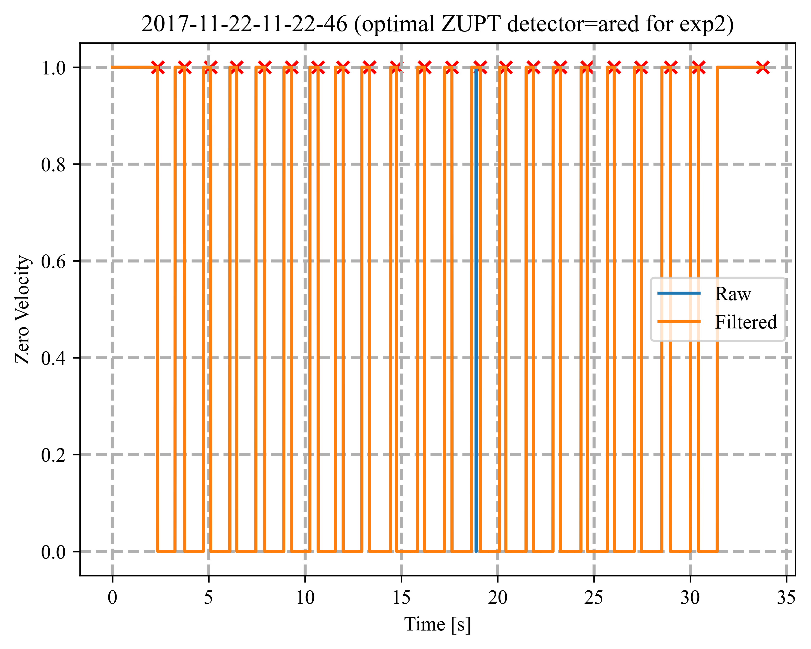

<h2>PyShoe Dataset - Correction for Bipedal Locomotion</h2>
<p align="justify">Just like in <a href="https://github.com/mtahakoroglu/OpenShoe-PyShoe-DeepShoe-FuseShoe">PyShoe-OpenShoe-DeepShoe-FuseShoe</a> repo, one needs the following installations to run the required scripts and obtain the results shown in the associated publication.</p>

<h3>Creating PyShoe Virtual Environment in Anaconda</h3>
<p align="justify">After installling Anaconda, launch <b>Anaconda PowerShell</b> and then type</p>

```
conda create --name pyshoe python=3.7
```

<p align="justify">to create <b>pyshoe</b> virtual environment (venv). Subsequently, type</p>

```
conda activate pyshoe
```

<p align="justify">to activate <b>pyshoe</b> venv.</p>

<h3>Installing Required Packages</h3>
<p align="justify">Type and enter the following commands in Anaconda PS terminal to install the required packages and libraries to run PyShoe codes and reproduce the results in the page and the paper. We thank <a href="https://scholar.google.com.tr/citations?user=F2NkKNAAAAAJ&hl=tr">Dr. Ramazan Özgür Doğan</a> for the assistance in setting up the environment.</p>

```
conda install pytorch==1.13.1 torchvision==0.14.1 torchaudio==0.13.1 pytorch-cuda=11.7 -c pytorch -c nvidia
```

<p align="justify">In <a href="https://github.com/mtahakoroglu/OpenShoe-PyShoe-DeepShoe-FuseShoe">PyShoe-OpenShoe-DeepShoe-FuseShoe</a> repo, we used</p>

```
pip install torch==1.13.1+cu117 torchvision==0.14.1+cu117 torchaudio==0.13.1 --extra-index-url https://download.pytorch.org/whl/cu117
```

<p align="justify">command to use pre-trained LSTM network for robust (adaptive) ZUPT detection and pedestrian INS. Here, due to some undetected steps in VICON training data (recall that Wagstaff <i>et. al.</i> (i.e., the creator of PyShoe dataset) included crawling data) and self-collected data, we needed to go over the 56 experiments in the training dataset <i><b>(i)</b></i> to correct for undetected steps (they are classified as 0 in ZV signal plot despite them actually being 1, i.e., it is false-positive) and <i><b>(i)</b></i> to exclude motions like crawling, which are not of type bipedal locomotion. For this reason, we had to retrain the bi-LSTM network proposed by Wagstaff <i>et. al.</i> again. In order to use GPU in the training process, instead of the pytorch installation command given above, we used the one below.</p>

```
pip install torch torchvision torchaudio --index-url https://download.pytorch.org/whl/cu117
```

<p align="justify">After this change, continue and complete the installation by entering the following commands in Anaconda PS in <b>pyshoe</b> virtual environment.<p>

```
conda install scikit-learn==0.19.1
```

```
conda install matplotlib
```

```
pip install pandas==1.1.5
```

<h3>Installing <b>liegroups</b> package</h3>

<p align="justify">After cloning this repository to your local computer, you must install <b><a href="https://github.com/utiasSTARS/liegroups" target="_blank">liegroups</a></b> package to run the code if you would like to reproduce the results shown here in this repo or the paper.</p>

<h3>Example Results (Own Sensor Data)</h3>
<p align="justify">When we first used pre-trained LSTM ZUPT detector and the resulting adaptive pedestrian INS on our own-collected data (where our sensor is 3DM-GX5-25), in two of five experiments conducted, we noticed that one stride is missed in each one after manual examination (we counted actual number of strides made in the experiments for checking if number of strides are correctly detected or not). The failure of detection of any stride would definitely affect the performance of the foot-mounted INS as the ZUPT corrections could not be made in respective stationary phases. Below, we show all five experiments made to test pre-trained LSTM ZUPT detector.</p>

<h4>Experiment 1 (74/75 strides detected) - Failure</h4>

<p align="justify">We see the very first stride (we assume the first stride that is also the start point is numbered as stride #0, i.e., initial stride) is not detected below. Note that ZV labels are filtered for correct stride detection but the filtered values are not used in trajectory generation in the second figure. In other words, in the trajectory plot, the red trajectory is obtained with raw (not filtered) LSTM ZUPT detected ZV labels, which misses some possible strides, while the strides (with red color cross signs x) are superimposed on the trajectory (labeled as LSTM)based on filtered LSTM ZUPT labels stride detections given in the first graph. </p>


<h4>Experiment 2 (24/24 strides detected) - Success</h4>


<h4>Experiment 3 (28/28 strides detected) - Success</h4>


<h4>Experiment 4 (28/28 strides detected) - Success</h4>


<h4>Experiment 5 (64/65 strides detected) - Failure</h4>

<p align=""justify>If the reader carefully examines the second plot (i.e., the trajectory), it is not hard to notice that the 33rd stride is not detected (the pedestrian made 24 strides in the first side of the rectangle, 8 strides in the second after a CCW 90 degree turn at the corner, and the very first stride on the third side is missed).</p>


<h3>Example Results (Vicon Data)</h3>




<h3>Adaptive and Robust ZUPT Detection Studies</h3>

<p align="justify">Adaptive ZUPT studies [<a href="#ref1" id="gobacktoref1">1</a>, <a href="#ref2" id="gobacktoref2">2</a>, <a href="#ref3" id="gobacktoref3">3</a>, <a href="#ref4" id="gobacktoref4">4</a>]. Liu <i>et al.</i> proposed an improved generalized likelihood ratio test (IGLRT) approach by using Vicon and Hallway experiments of PyShoe dataset <a href="#ref1" id="gobacktoref1">[1]</a>. Robust ZUPT detection studies employ various non-inertial sensing technologies such as magnetic sensors [<a href="#ref5 id="gobacktoref5"">5</a>], dynamic vision sensors (i.e., event cameras) [<a href="#ref6" id="gobacktoref6">6</a>], range sensor (i.e., ulrasonic sensor) [<a href="#ref7" id="gobacktoref7">7</a>] to accurately detect ZUPT samples in gait cycle and improve INS results.</p>

<h2>Foot-Mounted Pedestrian Inertial Navigation Datasets</h2>
<p align="justify">There are various datasets that are annotated with Vicon equipments. Some datasets are public [8-9]. Some datasets are not public [13-15]. OptiTrack (an optical motion capture system) study uses Heuristic Drift Reduction (HRD) to deal with heading errors [15].</p>

<h3>About PyShoe Dataset</h3>
<h4>Johan Wahlström & Isaac Skog's comments</h4>
<p align="justify"><b>Wahlström</b> <i>et al.</i> states that a reasonable approach to detect the actual ZUPT samples in a gait cycle would be to label the sensor unit as stationary whenever the velocity is zero [13]. This approach suffers from sensor and modeling errors as mentioned in [13]. More importantly, as the gait speed of the pedestrian changes, the threshold has to be calibrated. The natural solution is to set this threshold in such a way that the navigation performance is optimized. This idea is explored in PyShoe, where several zero-velocity detectors with different fixed thresholds were applied, one by one, to a number of motion trials (sequences of training data). This included both conventional detectors (e.g., SHOE, ARED) based on foot-mounted inertial measurements and detectors that utilized velocity estimates from high-accuracy reference systems (i.e., VICON). For each motion trial, ground-truth zero-velocity labels are extracted from the detector-threshold pair that gave the best positioning performance. To ensure that the best-performing fixed-threshold detector is approximately optimal over a given motion trial (so that there is no time-varying threshold that will give a substantially better performance), the environment and gait style (e.g., walking, running) were fixed within each individual motion trial.</p>

<p align="justify">PyShoe dataset is divided into two groups: Training and testing data. The training data - consisting of walking, running, stair-climbing, and crawling - was recorded from one user in a motion capture area of about 5m x 5m, and includes ground truth position from a camera tracking system. The testing data is divided into two subsets. The first subset was recorded in the hallways of a university building and includes ground truth at manually surveyed locations. This subset was recorded from five users alternating between walking and running. The second subset was recorded from one user walking up and down a staircase and includes ground truth vertical position data on a per-flight basis. In addition, each data recording in the second subset started and ended at the same position, and thus, the position accuracy can be evaluated based on
the corresponding loop-closure error. In [98], this data set was used to compare the performance of six zero-velocity detectors. Code was provided alongside the data.</p>

<h3>Studies that use PyShoe</h3>
<p align="justify">In [1] it says: "Publicly Mixed-Motion Dataset (referring to PyShoe): This dataset consists of the VICON dataset, the Hallway dataset, and the stairs-climbing dataset. The VICON dataset is collected by a LORD Micro-Strain 3DM-GX3-25 IMU at 200 Hz. As pointed out in PyShoe, it consists of 60 experiments, which not only includes walking and running modes but also stair-climbing and crawling modes. Both the Hallway dataset and the stairs-climbing dataset are collected by a Vector Nav VN−100 IMU at 200 Hz. The Hallway dataset consists of 38 motion experiments, which includes walking, running, and combined motion modes. The ground truth of the Hallway dataset is obtained by measuring the locations of the flat markers on the floor. A handheld trigger is given to record the current location versus the known marker location. In the stairs-climbing dataset, only the heights of trajectories are recorded."</p>
<p align="justify">In [1], PyShoe dataset is used to detect the ZVPs for the proposed IGLRT detector, in which not only the ground-truth position information is provided but also the ground-truth binary zero-velocity labels (moving versus stationary) are also provided. Since the trajectories of trials in the VICON dataset are very short, the Hallway dataset is also used to evaluate the performance of the proposed IGLRT detector.</p>

<p align="justify" id="ref1"><a href="#gobacktoref1">[1]</a> X. Liu, N. Li and Y. Zhang, <a href="https://ieeexplore.ieee.org/document/9956821" target="_blank">"A Novel Adaptive Zero Velocity Detection Algorithm Based on Improved General Likelihood Ratio Test Detector,"</a> in <i>IEEE Sensors Journal</i>, vol. 22, no. 24, pp. 24479-24492, 2022.</p>
<p align="justify" id="ref2"><a href="#gobacktoref2">[2]</a> B. Wagstaff, V. Peretroukhin and J. Kelly, <a href="https://ieeexplore.ieee.org/document/8115947" target="_blank">"Improving foot-mounted inertial navigation through real-time motion classification,"</a> in <i>2017 International Conference on Indoor Positioning and Indoor Navigation (IPIN)</i>, Sapporo, Japan, 2017, pp. 1-8.</p>
<p align="justify" id="ref3"><a href="#gobacktoref3">[3]</a> E. Sangenis, C. -S. Jao and A. M. Shkel, <a href="https://ieeexplore.ieee.org/abstract/document/9967027" target="_blank">"SVM-based Motion Classification Using Foot-mounted IMU for ZUPT-aided INS,"</a> in <i>2022 IEEE Sensors</i>, Dallas, TX, USA, 2022, pp. 1-4.</p>
<p align="justify" id="ref4"><a href="#gobacktoref4">[4]</a> Y. Wang and A. M. Shkel, <a href="https://ieeexplore.ieee.org/document/8861375" target="_blank">"Adaptive Threshold for Zero-Velocity Detector in ZUPT-Aided Pedestrian Inertial Navigation,"</a> in <i>IEEE Sensors Letters</i>, vol. 3, no. 11, pp. 1-4, 2019.</p>
<p align="justify" id="ref5"><a href="#gobacktoref5">[5]</a> Y. Wang and A. M. Shkel, <a href="https://ieeexplore.ieee.org/document/9133730" target="_blank">"A Review on ZUPT-Aided Pedestrian Inertial Navigation,"</a> in <i>2020 27th Saint Petersburg International Conference on Integrated Navigation Systems (ICINS)</i>, St. Petersburg, Russia, 2020.</p>
<p align="justify" id="ref6"><a href="#gobacktoref6">[6]</a> J. Wahlström, I. Skog, F. Gustafsson, A. Markham and N. Trigoni, <a href="https://ieeexplore.ieee.org/abstract/document/8715398" target="_blank">"Zero-Velocity Detection—A Bayesian Approach to Adaptive Thresholding,"</a> in <i>IEEE Sensors Letters</i>, vol. 3, no. 6, pp. 1-4, June 2019.</p>
<p align="justify" id="ref7"><a href="#gobacktoref7">[7]</a> Z. Meng, Z. Deng, P. Zhang and Z. Li, <a href="https://ieeexplore.ieee.org/document/10472598" target="_blank">"Adaptive Mid-Stance Phase Observer-Aided Pedestrian Inertial Navigation System for Varying Gait Speeds,"</a> in <i>IEEE Internet of Things Journal</i>, vol. 11, no. 12, pp. 21904-21915, 15 June, 2024.</p>
<p align="justify" #id="ref8"><a href="#gobacktoref8">[8]</a> C. . -S. Jao, K. Stewart, J. Conradt, E. Neftci and A. M. Shkel, <a href="https://ieeexplore.ieee.org/document/9244906" target="_blank">"Zero Velocity Detector for Foot-mounted Inertial Navigation System Assisted by a Dynamic Vision Sensor,"</a> in <i>2020 DGON Inertial Sensors and Systems (ISS)</i>, Braunschweig, Germany, 2020, pp. 1-18.</p>
<p align="justify" #id="ref9"><a href="#gobacktoref9">[9]</a> C. -S. Jao, Y. Wang and A. M. Shkel, <a href="https://ieeexplore.ieee.org/document/9278755" target="_blank">"A Zero Velocity Detector for Foot-mounted Inertial Navigation Systems Aided by Downward-facing Range Sensor,"</a> in <i>2020 IEEE SENSORS</i>, Rotterdam, Netherlands, 2020, pp. 1-4.</p>
<p align="justify" #id="ref10"><a href="#gobacktoref10">[10]</a> <a href="https://starslab.ca/foot-mounted-inertial-navigation-dataset/">University of Toronto STARS Lab. Foot-Mounted Inertial Navigation Dataset</a></p>
<p align="justify" #id="ref11"><a href="#gobacktoref11">[11]</a> Brandon Wagstaff, Valentin Peretroukhin, Jonathan Kelly, July 20, 2021, <a href="https://ieee-dataport.org/open-access/university-toronto-foot-mounted-inertial-navigation-dataset" target="_blank">"University of Toronto Foot-Mounted Inertial Navigation Dataset"</a>, IEEE Dataport, doi: <a href="https://dx.doi.org/10.21227/v1z6-9z84">https://dx.doi.org/10.21227/v1z6-9z84</a>.</p>
<p align="justify" #id="ref12"><a href="#gobacktoref10">[12]</a> J. Wahlström and I. Skog, <a href="https://ieeexplore.ieee.org/document/9174869" target="_blank">"Fifteen Years of Progress at Zero Velocity: A Review,"</a> in <i>IEEE Sensors Journal</i>, vol. 21, no. 2, pp. 1139-1151, 15 Jan., 2021.</p>
<a href="https://scholar.google.com/citations?view_op=view_citation&hl=en&user=9rHhb5IAAAAJ&citation_for_view=9rHhb5IAAAAJ:iH-uZ7U-co4C" target="_blank"></a>
<p align="justify"#id="ref13"><a href="#gobacktoref13">[13]</a> Guimarães, V.; Sousa, I.; Correia, M.V. <a href="https://www.mdpi.com/1424-8220/21/11/3940" target="_blank">Orientation-Invariant Spatio-Temporal Gait Analysis Using Foot-Worn Inertial Sensors.</a> <i>Sensors</i> 2021, 21, 3940.</p>
<p align="justify"#id="ref14"><a href="#gobacktoref14">[14]</a> Guimarães, V.; Sousa, I.; Correia, M.V. <a href="https://www.mdpi.com/1424-8220/21/22/7517" target="_blank">A Deep Learning Approach for Foot Trajectory Estimation in Gait Analysis Using Inertial Sensors.</a> <i>Sensors</i> 2021, 21, 7517.</p>
<p align="justify"#id="ref15"><a href="#gobacktoref15">[15]</a> J. Li et al., <a href="https://ieeexplore.ieee.org/abstract/document/10229495" taget="_blank">"Learning-Based Stance Phase Detection and Multisensor Data Fusion for ZUPT-Aided Pedestrian Dead Reckoning System,"</a> in <i>IEEE Internet of Things Journal</i>, vol. 11, no. 4, pp. 5899-5911, 15 Feb., 2024.</p>
</ul>